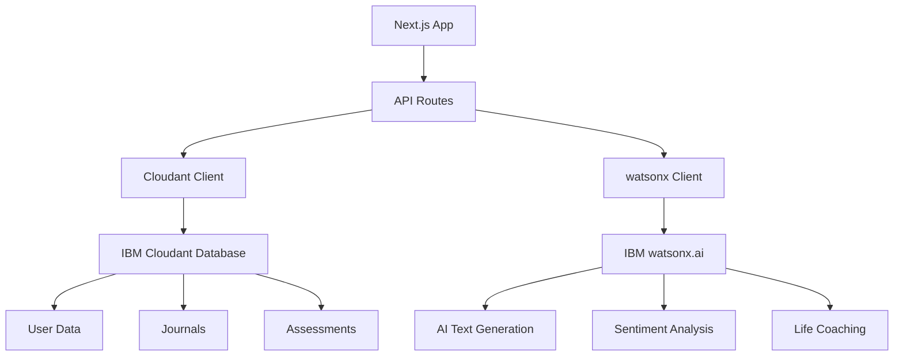

# IBM Cloud Integration Plan for Her.comeback.ai

## Overview
This document outlines the complete setup process for integrating IBM Cloud services (Cloudant NoSQL Database and watsonx.ai) with the Her platform - an AI companion for mothers navigating life transitions.

## Architecture



## Services Required

### 1. IBM Cloudant (NoSQL Database)
- **Purpose**: Store user profiles, journal entries, life assessments, and application data
- **Databases Needed**:
  - `users` - User profiles and authentication data
  - `journals` - Daily journal entries with sentiment analysis
  - `assessments` - Life assessment scores and progress tracking
  - `recipes` - Generated meal plans and nutrition data
  - `career` - Resume rebuilds and career comeback plans

### 2. IBM watsonx.ai (AI/ML Platform)
- **Purpose**: Power AI features including text generation, sentiment analysis, and personalized coaching
- **Models Used**:
  - `ibm/granite-13b-instruct-v2` - Primary text generation model
  - Custom prompts for life assessment, career coaching, recipe generation

## Implementation Steps

### Phase 1: Environment Setup
1. Create `.env.local` file with IBM Cloud credentials
2. Install IBM Cloud CLI for service management
3. Authenticate with provided API key

### Phase 2: Service Discovery & Creation
1. Check existing IBM Cloud resources
2. Create Cloudant instance if needed (Lite plan available)
3. Create watsonx.ai project if needed
4. Retrieve all service credentials

### Phase 3: Database Configuration
1. Initialize Cloudant databases
2. Set up database schemas and indexes
3. Configure security and access controls
4. Test database connectivity

### Phase 4: AI Integration
1. Configure watsonx.ai authentication
2. Test text generation endpoints
3. Validate sentiment analysis
4. Test specialized AI features (assessment, career, recipes)

### Phase 5: Application Integration
1. Update environment variables
2. Test all API routes
3. Verify end-to-end functionality
4. Document configuration

## Security Considerations

- API keys stored in `.env.local` (gitignored)
- Service-specific credentials for Cloudant and watsonx
- IAM authentication for all IBM Cloud services
- Regular key rotation recommended
- Minimum required permissions principle

## Environment Variables Required

```bash
# IBM Cloud Platform
IBM_CLOUD_API_KEY=ApiKey-ba67cf82-ab15-407a-818e-6999dbfeba72

# Cloudant Database
CLOUDANT_URL=https://[instance-id].cloudantnosqldb.appdomain.cloud
CLOUDANT_APIKEY=[service-specific-key]

# watsonx.ai
WATSONX_API_KEY=[service-specific-key or platform key]
WATSONX_PROJECT_ID=[project-id]
WATSONX_URL=https://us-south.ml.cloud.ibm.com
```

## Database Schema

### Users Collection
```json
{
  "_id": "user_[uuid]",
  "email": "string",
  "name": "string",
  "mumType": "working_mum|stay_at_home|returning_to_work|single_mum",
  "createdAt": "timestamp",
  "lastActive": "timestamp",
  "preferences": {}
}
```

### Journals Collection
```json
{
  "_id": "journal_[uuid]",
  "userId": "string",
  "content": "string",
  "sentiment": "positive|negative|neutral",
  "emotions": ["array"],
  "aiResponse": "string",
  "createdAt": "timestamp"
}
```

### Assessments Collection
```json
{
  "_id": "assessment_[uuid]",
  "userId": "string",
  "scores": {
    "health": "number",
    "mind": "number",
    "relationships": "number",
    "work": "number",
    "nourish": "number"
  },
  "aiInsights": "string",
  "createdAt": "timestamp"
}
```

## Testing Checklist

- [ ] IBM Cloud authentication successful
- [ ] Cloudant instance accessible
- [ ] All databases created
- [ ] Database read/write operations work
- [ ] watsonx.ai authentication successful
- [ ] Text generation working
- [ ] Sentiment analysis accurate
- [ ] All API routes functional
- [ ] Error handling in place
- [ ] Documentation complete

## Next Steps After Setup

1. Implement user authentication flow
2. Build data migration scripts if needed
3. Set up monitoring and logging
4. Configure backup strategies
5. Plan for scaling (upgrade from Lite plans)

## Support Resources

- [IBM Cloud Documentation](https://cloud.ibm.com/docs)
- [Cloudant API Reference](https://cloud.ibm.com/apidocs/cloudant)
- [watsonx.ai Documentation](https://dataplatform.cloud.ibm.com/docs/content/wsj/analyze-data/fm-overview.html)
- [IBM Cloud CLI Guide](https://cloud.ibm.com/docs/cli)

## Cost Considerations

- **Cloudant Lite**: Free tier available (1GB storage, 20 lookups/sec)
- **watsonx.ai**: Pay-as-you-go pricing based on tokens processed
- **Recommendations**: Start with Lite/Free tiers, monitor usage, upgrade as needed

---

**Status**: Ready for implementation
**Last Updated**: 2026-05-02
**API Key Provided**: ApiKey-ba67cf82-ab15-407a-818e-6999dbfeba72